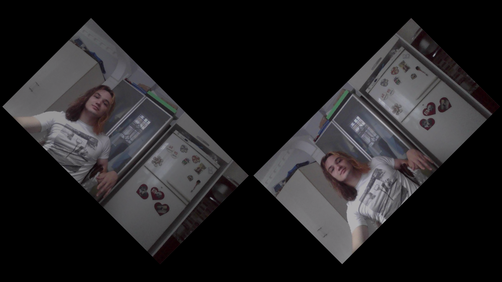
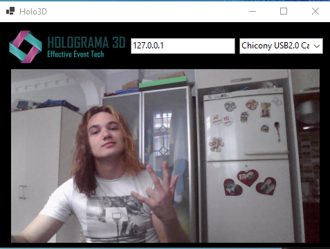

# Holo3D
Holo3D is a powerful streaming application that provides real-time audio and video streaming over UDP. Designed for full-screen, two-sided displays, it ensures rotated view compatibility and offers robust error handling. The architecture consists of a Receiver and Streamer, allowing flexibility and ease of use.

## Features
- **Real-Time Audio & Video Streaming:** Utilizing UDP ports, Holo3D seamlessly streams both audio and video data.
- **Full-Screen Compatibility:** Tailored for a two-sided screen, enabling rotated view requirements.
- **Simple Target Configuration:** Streamer begins streaming after target URL entry and video source selection.
- **Error Handling:** Equipped with quality safety (q.s.) error handling to manage and control any network fluctuations.
- **Quick Start Mode:** Simplified setup through the build folder, including a localhost testing option.

## Usage
### Quick Start
1. Navigate to the `Build` folder.
2. Run the `Streamer` application.
3. Enter the IP address and select the video source (Use `127.0.0.1` for localhost testing).
4. Run the `Receiver` application.

### Ports
- **Video Streaming Port:** 5000
- **Audio Streaming Port:** 5001

## How It Works
### Streamer
- The Streamer waits for the target URL and video source selection.
- Once selected, the streaming process begins, sending video and audio data over the defined UDP ports.

### Receiver
- The Receiver continually waits for video and audio data.
- Since it uses UDP, if there are no data, the Receiver will continue to wait without any issue, ensuring a smooth experience.

## Screenshots

## Contributing & Support
Feel free to reach out for questions, contributions, or further assistance.